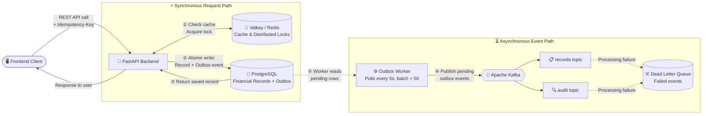

# Zorvyn Finance Backend

A production-grade, resilient backend for a finance dashboard system. Built with **FastAPI**, **SQLAlchemy (Async)**, **PostgreSQL**, **Valkey (Redis)**, and **Apache Kafka**.

## 🚀 Key Features

### 1. Robust Role-Based Access Control (RBAC)
The system strictly enforces permissions across three defined roles:
- **Viewer**: Read-only access to dashboard summaries and recent records.
- **Analyst**: Access to dashboard summaries, trends, and detailed record viewing.
- **Admin**: Full management access, including CRUD for financial records and user management.

### 2. Financial Records Management
- Complete CRUD for transactions (Amount, Type, Category, Date, Notes).
- Advanced filtering by type, category, and date range.
- **Precision First**: Uses `Decimal` types for all monetary calculations to avoid floating-point errors.

### 3. High-Performance Dashboard APIs
Aggregated data endpoints optimized with **Valkey (Redis) caching**:
- **Summary**: Total income, expenses, and net balance.
- **Trends**: Monthly income/expense aggregates.
- **Categories**: Breakdown of spending by category.
- **Recent Activity**: Latest transactions.

### 4. Enterprise-Grade Resilience
- **Transactional Outbox Pattern**: Ensures database state and Kafka events are always consistent.
- **Idempotency Middleware**: Prevents duplicate transactions for a single `Idempotency-Key`.
- **Distributed Locking**: Uses Valkey-based locks to prevent concurrent modification of the same record.
- **Circuit Breakers**: Protects against cascading failures from external services (Kafka/Redis).
- **Dead Letter Queue (DLQ)**: Automatically routes failed Kafka events for admin inspection.

---

## 🛠 Tech Stack

- **Framework**: FastAPI (Python 3.12+)
- **Database**: PostgreSQL (Aiven)
- **Caching**: Valkey (Aiven - Redis drop-in)
- **Event Streaming**: Apache Kafka (Aiven)
- **ORM**: SQLAlchemy 2.0 (Async)
- **Migrations**: Alembic

---

## 🧩 System Components & Roles

### 🔴 Valkey (Redis) - The "Fast-Access" Layer
Valkey handles high-speed operations that require sub-millisecond latency:
- **Dashboard Caching**: Stores expensive-to-calculate financial aggregates (totals, trends) to ensure the frontend loads instantly. Uses a *Cache-Aside* invalidation strategy.
- **Distributed Locking**: Prevents race conditions by ensuring only one process can modify a specific record at a time using `SET NX PX`.
- **Idempotency**: Prevents duplicate transactions by storing and verifying `Idempotency-Key` headers for 24 hours.

### 📨 Apache Kafka - The "Reliable" Layer
Kafka serves as the backbone for all asynchronous communication and event-driven logic:
- **Transactional Outbox**: Decouples the database state from the message bus, ensuring that every DB change is guaranteed to be published eventually.
- **Event Streaming**: Distributes `records` and `audit` data to downstream consumers via dedicated topics (`TOPIC_RECORDS`, `TOPIC_AUDIT`).
- **Resilience (DLQ)**: Automatically routes events that fail processing after retries to a **Dead Letter Queue (DLQ)** for manual inspection.

---

## 📋 Infrastructure Requirements
To run this system, the following infrastructure is required:

| Component | Minimum Version | Function |
| :--- | :--- | :--- |
| **Python** | 3.12+ | Core runtime |
| **PostgreSQL** | 15+ | Relational data & Outbox storage |
| **Valkey / Redis**| 7.2+ | Distributed state & Caching |
| **Apache Kafka** | 3.6+ | Event streaming & Durable messaging |

---

## 📐 Architecture & Dataflow



---

## 🌍 Live Deployment
The system is deployed and accessible via the following URLs:
- **Backend API**: [https://zorvyn-backend-zc6t.onrender.com](https://zorvyn-backend-zc6t.onrender.com)
- **Interactive Documentation**: [https://zorvyn-backend-zc6t.onrender.com/docs](https://zorvyn-backend-zc6t.onrender.com/docs)
- **Frontend Dashboard**: https://zorvyn-backend-liart.vercel.app

---

## 📖 API Documentation

The API documentation is available both locally and in production:

### 🌐 Live Docs (Render)
- **Swagger UI**: [https://zorvyn-backend-zc6t.onrender.com/docs](https://zorvyn-backend-zc6t.onrender.com/docs)
- **ReDoc**: [https://zorvyn-backend-zc6t.onrender.com/redoc](https://zorvyn-backend-zc6t.onrender.com/redoc)

### 💻 Local Docs (Dev)
- **Swagger UI**: `http://localhost:8000/docs`
- **ReDoc**: `http://localhost:8000/redoc`

### Core Enpoints Summary
| Method | Endpoint | Role Required | Description |
| :--- | :--- | :--- | :--- |
| `POST` | `/auth/token` | None | Dev endpoint to issue mock JWTs |
| `GET` | `/dashboard/summary` | Viewer+ | Aggregated totals |
| `GET` | `/records` | Viewer+ | List/Filter transactions |
| `POST` | `/records` | Admin | Create new record |
| `PATCH` | `/records/{id}` | Admin | Update record |
| `GET` | `/admin/dlq` | Admin | Monitor failed events |

---

## ⚙️ Setup & Installation

### 1. Environment Variables
Copy `.env.example` to `.env` and fill in your Aiven credentials and JWT secret.

### 2. Install Dependencies
```bash
python -m venv venv
source venv/bin/activate  # venv\Scripts\activate on Windows
pip install -r requirements.txt
```

### 3. Database Migrations
```bash
alembic upgrade head
```

### 4. Run Application
```bash
uvicorn app.main:app --reload
```

---

## 📝 Assumptions & Trade-offs
- **Mock Authentication**: For the convenience of evaluation, a dedicated `/auth/token` endpoint issues JWTs directly without a password check. In production, this would be integrated with OAuth2/OIDC.
- **Cache-Aside Invalidation**: The dashboard cache is invalidated globally on any record mutation to ensure immediate data consistency for the user.
- **Async Everything**: The entire stack is built using asynchronous patterns (async pg, aiokafka, redis-py) to maximize concurrent throughput.
