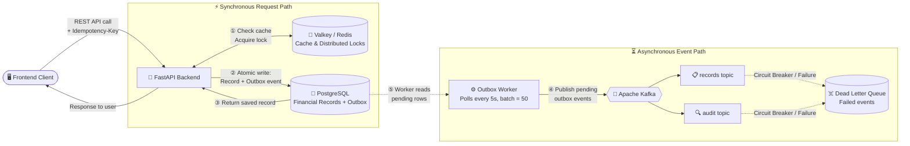

# Zorvyn Finance Backend

A production-grade, resilient financial dashboard system. Built with **FastAPI**, **SQLAlchemy (Async)**, **PostgreSQL**, **Valkey (Redis)**, and **Apache Kafka**.

## 🚀 Key Features

### 1. Robust Role-Based Access Control (RBAC)
The system strictly enforces permissions across three defined roles:
- **Viewer**: Read-only access to dashboard summaries and recent records.
- **Analyst**: Access to dashboard summaries, trends, and detailed record viewing.
- **Admin**: Full management access, including CRUD for financial records and user management.

### 2. Advanced Financial Visualization
- **Dynamic Charts**: Interactive transaction trends and net income summaries using **Chart.js**.
- **Income vs. Expense**: Visual clarity with expenses represented on the negative y-axis for intuitive financial tracking.
- **Aggregated Summaries**: Real-time calculation of total income, expenses, and net balance with trend indicators.

### 3. High-Performance APIs & Caching
Aggregated data endpoints optimized with **Valkey (Redis) caching**:
- **Cache-Aside Strategy**: Ensures sub-millisecond response times for dashboard summaries while maintaining data consistency.
- **Precision First**: Uses `Decimal` types for all monetary calculations to eliminate floating-point errors.

### 4. Enterprise-Grade Resilience
- **Transactional Outbox Pattern**: Guarantees consistency between database state and Kafka event publishing.
- **Circuit Breakers**: Protects the system from cascading failures using **Pybreaker** for Kafka and Redis integrations.
- **Idempotency Middleware**: Prevents duplicate transactions for a single `Idempotency-Key`.
- **Distributed Locking**: Uses Valkey-based locks to prevent concurrent race conditions on record modifications.
- **Dead Letter Queue (DLQ)**: Automatically routes failed Kafka events for manual inspection and recovery.

---

## 🛠 Tech Stack

### Backend
- **Framework**: [FastAPI](https://fastapi.tiangolo.com/) (Python 3.12+)
- **Database**: [PostgreSQL](https://www.postgresql.org/) (Hosted on Aiven)
- **ORM**: [SQLAlchemy 2.0](https://www.sqlalchemy.org/) (Asyncio)
- **Caching & Locks**: [Valkey](https://valkey.io/) (Redis-compatible, Aiven)
- **Event Streaming**: [Apache Kafka](https://kafka.apache.org/) (Aiven)
- **Migrations**: [Alembic](https://alembic.sqlalchemy.org/)
- **Validation**: [Pydantic v2](https://docs.pydantic.dev/)

### Frontend
- **Core**: Vanilla HTML5, CSS3, JavaScript (ES6+)
- **Charts**: [Chart.js](https://www.chartjs.org/)
- **Typography**: [Google Fonts (Outfit)](https://fonts.google.com/specimen/Outfit)
- **Design**: Premium Dark Mode with glassmorphism and micro-animations.

---

## 🧩 System Architecture



---

## 🌍 Live Deployment

| Component | URL |
| :--- | :--- |
| **Backend API** | [https://zorvyn-backend-zc6t.onrender.com](https://zorvyn-backend-zc6t.onrender.com) |
| **API Docs (Swagger)** | [https://zorvyn-backend-zc6t.onrender.com/docs](https://zorvyn-backend-zc6t.onrender.com/docs) |
| **Frontend Dashboard** | [https://zorvyn-backend-liart.vercel.app](https://zorvyn-backend-liart.vercel.app) |

---

## 📖 API Documentation Summary

| Method | Endpoint | Role Required | Description |
| :--- | :--- | :--- | :--- |
| `POST` | `/auth/token` | None | Dev endpoint to issue mock JWTs |
| `GET` | `/dashboard/summary` | Viewer+ | Aggregated totals and trends |
| `GET` | `/records` | Viewer+ | List/Filter transactions |
| `POST` | `/records` | Admin | Create new record (Idempotency req.) |
| `PATCH` | `/records/{id}` | Admin | Update record |
| `DELETE` | `/records/{id}` | Admin | Delete record |
| `GET` | `/admin/dlq` | Admin | Monitor failed events |

---

## ⚙️ Setup & Installation

### 1. Environment Variables
Copy `.env.example` to `.env` and fill in your Aiven credentials and JWT secret.

### 2. Install Dependencies
```bash
python -m venv venv
source venv/bin/activate  # venv\Scripts\activate on Windows
pip install -r requirements.txt
```

### 3. Database Migrations
```bash
alembic upgrade head
```

### 4. Run Application
```bash
uvicorn app.main:app --reload
```

---

## 📝 Assumptions & Trade-offs
- **Mock Authentication**: For the convenience of evaluation, a dedicated `/auth/token` endpoint issues JWTs directly without a password check. In production, this would be integrated with OAuth2/OIDC.
- **Cache-Aside Invalidation**: The dashboard cache is invalidated globally on any record mutation to ensure immediate data consistency for the user.
- **Async Everything**: The entire stack is built using asynchronous patterns (async pg, aiokafka, redis-py) to maximize concurrent throughput.
